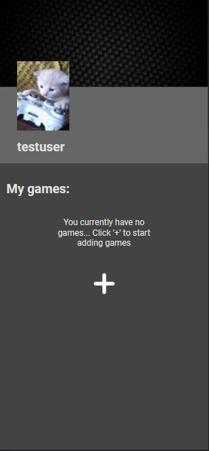
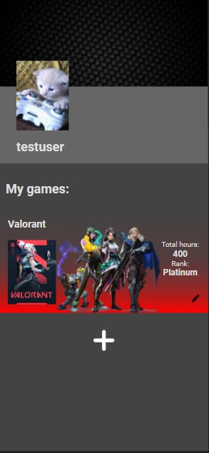
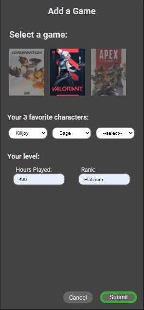

# Project-Tech

Mijn blok tech applicatie is een matching app voor games om elkaar te vinden gebaseerd op welke game ze spelen en hoe ze deze spelen. Op je profiel kan je een game toevoegen en daar vervolgens informatie bij geven zoals welke character je speelt en welk niveau je hebt.

   

## Feature

De feature die ik heb uitgewerkt is het aanpassen van je profiel. Je kan games toevoegen die je speelt en daarbij aangeven welke characters je speelt en welk niveau je hebt. Hier op zou je dan met andere gebruiker gematcht kunnen worden zodat je samen kan gamen en een gezellige ervaring kan hebben (of een hele serieuze natuurlijk). Je kan game kaarten toevoegen via een formulier, aanpassen en verwijderen wanneer je wilt, zo is jouw profiel altijd up-to-date.

## Installeren

Open de terminal en gebruik `cd` om naar de gewenste map te navigeren.
1. Clone de repository

```
git clone https://github.com/JeffTC72/Project-Tech
```

2. Installeer alle benodigde packages

```
npm install
```

3. Maak een [Database](https://github.com/JeffTC72/Project-Tech/wiki/database) en zet de connection string in .env
4. Start de server

```
npm run start
```

5. Open de browser en vraag de app op

```
localhost:3000
```

## License
[MIT license](https://github.com/JeffTC72/Project-Tech/blob/main/LICENSE.txt)
